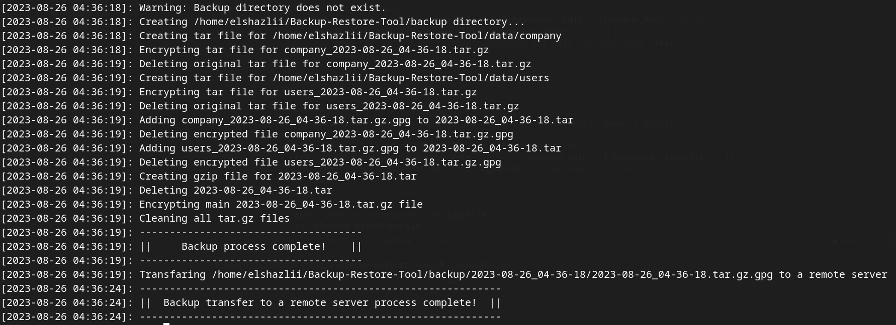

# Backup and Restore Tool

This tool provides functionality for secure encrypted backup and restore of directories in Linux. It consists of three main scripts: `backup.sh`, `restore.sh`, and `backup_restore_lib.sh`.

## Usage

### backup.sh

The `backup.sh` script is used to perform a backup of a specific directory. It takes four command-line parameters:
backup.sh `-s` <source_directory> `-b` <backup_directory> `-k` <encryption_key> `-d` <days>

- `-s`: The directory to be backed up.
- `-b`: The directory where the backup will be stored.
- `-k`: The encryption key used to encrypt the backup.
- `-d`: The number of days to backup only the changed files.

Example usage:
backup.sh -s /path/to/source -b /path/to/backup -k myencryptionkey -d 7

### restore.sh

The `restore.sh` script is used to restore a backup that was created using `backup.sh`. It takes three command-line parameters:
restore.sh `-b` <backup_directory> `-r` <restore_directory> `-k` <decryption_key>

- `-b`: The directory that contains the backup.
- `-r`: The directory where the backup should be restored to.
- `-k`: The decryption key used to restore the backup.

Example usage:
restore.sh -b /path/to/backup -r /path/to/restore -k mydecryptionkey

## Automated Backups

To setup daily automated backups using crontab:

- Edit crontab: `crontab -e`
- Add a line like:  **`0  5  *  *  *   /path/to/cronjob.sh`**
- The cronjob will run backup.sh daily at `5:00 AM`
- Backup logs will be written to `cron_backup_logs.log`

Remember to replace with the actual paths and keys used in your code.

## Prerequisites

- Linux operating system
- `tar` command-line tool
- `gpg` (GNU Privacy Guard) tool
- `scp` (Secure Copy) tool
- `labsuser.pem` private key file (for remote server backup)

## Important Notes

- Make sure to provide valid directories and keys as command-line parameters.
- The backup script will create a new directory for each backup with a timestamp in the format `YYYY-MM-DD_HH-MM-SS`.
- The backup script will compress each directory within the source directory into a separate tar file, encrypt it using the provided encryption key, and delete the original tar file.
- The backup script will also create a main tar file that includes all encrypted tar files and compress it.
- The encrypted main tar file will be transferred to a remote server using `scp` if the `labsuser.pem` private key file is available.

Remember to replace /path/to/source, /path/to/backup, /path/to/restore, myencryptionkey, and mydecryptionkey with the actual paths and keys used in your code.

